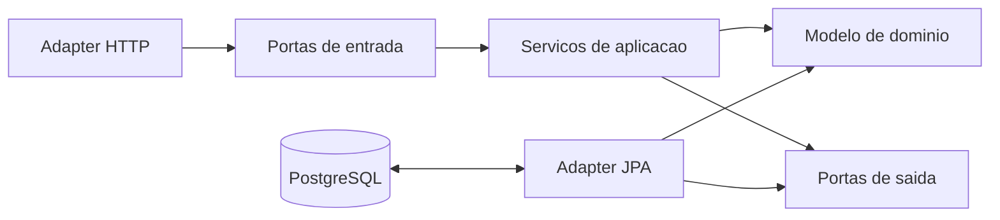

# ADR 0001 - Arquitetura hexagonal e Java 25

- Status: aceita
- Data: 2026-09-04

## Contexto

O CorreAI nasceu como um MVP organizado em camadas (`controller`, `service`,
`repository` e `domain`). O produto deve crescer com metas, planejamento,
conquistas, aplicativo mobile e, futuramente, dashboard web. Para preservar as
regras de negocio durante essa evolucao, a API precisa manter o dominio
independente de HTTP, persistencia e frameworks.

O repositorio ja iniciou a migracao para pacotes `domain`, `application` e
`adapter`. A versao alvo do runtime tambem passou de Java 17 para Java 25 LTS.

## Decisao

Manter a API como um monolito hexagonal, com dependencias apontando para dentro:

Responsabilidades:

- `domain/model`: entidades, valores e regras puras, sem Spring, JPA ou Servlet.
- `domain/port/in`: contratos dos casos de uso expostos aos adapters de entrada.
- `domain/port/out`: contratos de infraestrutura exigidos pela aplicacao.
- `application`: orquestracao dos casos de uso e transacoes.
- `adapter/in`: entrada HTTP, validacao de transporte e DTOs REST.
- `adapter/out`: persistencia JPA, entidades de banco e mapeadores.

As portas permanecem temporariamente em `domain/port` para evitar uma segunda
movimentacao ampla durante o MVP. Elas nao podem depender de framework. Quando
novas capacidades forem adicionadas, a estrutura deve evoluir por capacidade de
negocio (`activity`, `identity`, `goal`, `planning`, `achievement`), preservando
as mesmas fronteiras internas.

O build e o runtime oficiais usam Java 25. O build da imagem deve executar
`mvn clean verify`; nao e permitido publicar uma imagem criada com testes
ignorados.

## Regras de dependencia

1. O dominio nao importa Spring, Jakarta Persistence, Servlet ou adapters.
2. Adapters HTTP chamam somente portas de entrada.
3. Servicos de aplicacao dependem somente do dominio e de portas.
4. Repositorios Spring Data e entidades JPA existem apenas no adapter de saida.
5. DTOs HTTP e entidades JPA nao atravessam portas.
6. Contratos REST atuais devem permanecer compativeis durante reorganizacoes.

## Consequencias

Beneficios:

- regras de negocio testaveis sem infraestrutura;
- substituicao de HTTP, JPA ou banco sem alterar o dominio;
- crescimento incremental das capacidades do produto.

Custos:

- mapeamento explicito entre DTOs, dominio e entidades JPA;
- mais contratos e disciplina de dependencias;
- necessidade de testes arquiteturais conforme o projeto crescer.

## Validacao

Em 2026-09-04, a imagem foi construida com Maven 3.9.12 e Temurin 25.0.4.
O comando `mvn clean verify` executado no estagio de build concluiu com 28 testes,
sem falhas, erros ou testes ignorados.

## Proximas decisoes

- Adotar Flyway e versionar o esquema antes de criar novas entidades.
- Proteger a identidade anonima; um UUID arbitrario nao deve conceder acesso.
- Injetar relogio/timezone e centralizar o calculo de streak.
- Adicionar regras ArchUnit para tornar estas dependencias executaveis.
- Avaliar Spring Boot 4.1 em ADR separado, sem misturar a troca de framework com
  a reorganizacao arquitetural.